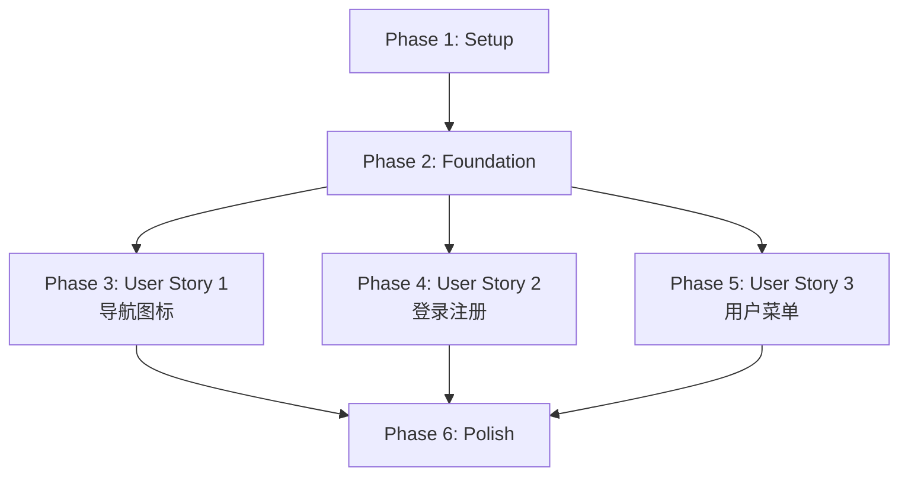

# Implementation Tasks: 优化首页标题栏导航

**Feature**: 005-optimize-header-nav  
**Branch**: `005-optimize-header-nav`  
**Generated**: 2025-10-31  
**Total Tasks**: 31  
**Estimated Effort**: 8-12 hours

## Task Summary by Phase

| Phase | Tasks | Parallelizable | Story |
|-------|-------|----------------|-------|
| Phase 1: Setup | 2 | 1 | - |
| Phase 2: Foundational | 4 | 3 | - |
| Phase 3: User Story 1 | 9 | 6 | 访客快速理解导航功能 |
| Phase 4: User Story 2 | 9 | 5 | 未登录用户注册和登录 |
| Phase 5: User Story 3 | 5 | 3 | 已登录用户看到个人入口 |
| Phase 6: Polish | 2 | 1 | - |

## Dependencies & Execution Order



**User Story Independence**:
- ✅ US1 (导航图标) - 完全独立，可单独实现和测试
- ✅ US2 (登录注册) - 依赖 Foundation，可与 US1 并行
- ✅ US3 (用户菜单) - 依赖 US2 (需要认证状态)

## Parallel Execution Opportunities

### Phase 2 (Foundational) - 3 tasks in parallel
```bash
# Developer A
T003 - frontend/src/types/auth.ts
T004 - frontend/src/lib/api/auth.ts

# Developer B  
T005 - frontend/src/lib/stores/authStore.ts
```

### Phase 3 (User Story 1) - 6 tasks in parallel
```bash
# Developer A (Desktop UI)
T008 - frontend/src/components/layout/NavigationMenu.tsx
T009 - frontend/src/components/layout/Header.tsx

# Developer B (Mobile UI)
T010 - frontend/src/components/layout/MobileMenu.tsx
T011 - frontend/src/hooks/useMediaQuery.ts

# Developer C (Tests)
T012 - frontend/src/components/layout/__tests__/NavigationMenu.test.tsx
T013 - frontend/src/components/layout/__tests__/MobileMenu.test.tsx
```

### Phase 4 (User Story 2) - 5 tasks in parallel
```bash
# Developer A (Login)
T018 - frontend/src/components/auth/LoginModal.tsx
T019 - frontend/src/components/auth/LoginForm.tsx

# Developer B (Register)
T020 - frontend/src/components/auth/RegisterModal.tsx
T021 - frontend/src/components/auth/RegisterForm.tsx

# Developer C (Auth Buttons)
T022 - frontend/src/components/layout/AuthButtons.tsx
```

### Phase 5 (User Story 3) - 3 tasks in parallel
```bash
# Developer A
T026 - frontend/src/components/layout/UserMenu.tsx
T027 - frontend/src/components/layout/UserAvatar.tsx

# Developer B (Tests)
T028 - frontend/src/components/layout/__tests__/UserMenu.test.tsx
```

---

## Phase 1: Setup (Project Initialization)

**Goal**: 安装新依赖并验证开发环境

**Independent Test Criteria**: 
- ✅ `npm install` 成功，无依赖冲突
- ✅ 开发服务器启动成功 (`npm run dev`)

### Tasks

- [x] T001 安装 Radix UI Dialog 依赖到 frontend/package.json
  - 运行: `cd frontend && npm install @radix-ui/react-dialog`
  - 验证: package.json 中出现 "@radix-ui/react-dialog": "^1.1.15" ✅

- [x] T002 [P] 验证开发环境配置
  - 检查 TypeScript 版本 >= 5.0 ✅ (5.9.3)
  - 检查 Next.js 版本 = 15.4.6 ✅
  - 检查 React 版本 = 19.1.0 ✅
  - 验证: 环境配置正确

---

## Phase 2: Foundational (Blocking Prerequisites)

**Goal**: 创建共享的类型定义、API 客户端和认证状态管理，所有用户故事都依赖这些基础设施

**Independent Test Criteria**:
- ✅ 类型定义编译无错误
- ✅ API 客户端可以成功调用后端 (模拟或真实)
- ✅ Zustand store 可以正确持久化到 localStorage

### Tasks

- [ ] T003 [P] 创建认证相关类型定义 frontend/src/types/auth.ts
  - 定义 User, AuthSession, LoginCredentials, RegisterData, ApiResponse 接口
  - 参考: data-model.md §1 核心实体
  - 验证: TypeScript 编译无错误

- [ ] T004 [P] 实现认证 API 客户端 frontend/src/lib/api/auth.ts
  - 实现 login, register, getCurrentUser, logout 方法
  - 参考: contracts/auth-api.yaml
  - 使用环境变量 NEXT_PUBLIC_API_URL (默认 http://localhost:8000/api)
  - 验证: 可以成功发送请求到后端 (使用 console.log 或 Postman 测试)

- [ ] T005 [P] 创建 Zustand 认证状态管理 frontend/src/lib/stores/authStore.ts
  - 实现 AuthState 接口 (user, token, isAuthenticated, isLoading, error)
  - 实现 login, register, logout, fetchCurrentUser, clearError 方法
  - 配置 persist 中间件 (name: 'auth-storage', partialize: user/token/isAuthenticated)
  - 参考: data-model.md §2.1 AuthStore
  - 验证: localStorage 中可以看到 'auth-storage' 键

- [ ] T006 创建自定义 Hook frontend/src/hooks/useAuth.ts
  - 包装 useAuthStore，提供简化的认证状态访问
  - 导出 user, isAuthenticated, login, logout 等方法
  - 验证: 可以在组件中导入并使用

---

## Phase 3: User Story 1 - 访客快速理解导航功能 (P1)

**Story Goal**: 访客打开首页时，能够通过导航栏的图标和文字快速识别各个功能入口

**Independent Test Criteria**:
- ✅ 桌面端 (≥768px): 横向显示 4 个带图标的导航项 (首页、市场行情、板块、关于)
- ✅ 移动端 (<768px): 显示汉堡菜单图标，点击展开显示所有导航项
- ✅ 图标与文字对齐，间距统一
- ✅ 鼠标悬停时有视觉反馈
- ✅ 汉堡菜单在页面滚动时自动关闭

### Tasks

- [x] T007 创建导航配置文件 frontend/src/lib/constants/navigation.ts ✅
  - 定义 navItems 数组 (id, label, href, icon, order)
  - 映射图标: Home→首页, TrendingUp→市场行情, LayoutGrid→板块, Info→关于
  - 参考: research.md §4 图标映射表

- [ ] T008 [P] [US1] 实现桌面端导航菜单组件 frontend/src/components/layout/NavigationMenu.tsx
  - 显示 navItems 数组中的所有导航项
  - 每个项显示图标 + 文字
  - 当前页面高亮 (usePathname 检测)
  - 鼠标悬停效果 (bg-gray-100)
  - 响应式: md:flex (≥768px 显示)
  - 验证: 导航项横向排列，图标清晰可见

- [ ] T009 [P] [US1] 创建主 Header 组件 frontend/src/components/layout/Header.tsx
  - 引入 NavigationMenu 组件
  - 固定在页面顶部 (sticky top-0)
  - 显示 Logo + NavigationMenu + 占位符 (登录按钮后续添加)
  - 高度 64px, 背景白色, 底部边框
  - 验证: Header 固定在顶部，滚动时不消失

- [ ] T010 [P] [US1] 实现移动端汉堡菜单组件 frontend/src/components/layout/MobileMenu.tsx
  - 显示汉堡菜单图标 (Menu from lucide-react)
  - 点击展开全屏菜单 (或侧边抽屉)
  - 显示所有 navItems
  - 点击遮罩层或关闭按钮关闭菜单
  - 监听页面滚动事件,自动关闭菜单
  - 监听屏幕旋转事件 (orientationchange),自动关闭菜单
  - 响应式: 仅在 <768px 显示
  - 参考: research.md §5 响应式策略
  - 验证: 移动端显示汉堡菜单，点击展开显示导航项

- [ ] T011 [P] [US1] 创建响应式断点 Hook frontend/src/hooks/useMediaQuery.ts (如果不存在)
  - 实现 useMediaQuery(query: string) Hook
  - 返回布尔值表示媒体查询是否匹配
  - 例如: useMediaQuery('(min-width: 768px)')
  - 验证: 可以在组件中使用，窗口大小改变时正确更新

- [ ] T012 [P] [US1] 编写导航菜单单元测试 frontend/src/components/layout/__tests__/NavigationMenu.test.tsx
  - 测试: 渲染所有导航项
  - 测试: 当前页面高亮
  - 测试: 点击导航项跳转
  - 使用 Jest + React Testing Library

- [ ] T013 [P] [US1] 编写移动端菜单单元测试 frontend/src/components/layout/__tests__/MobileMenu.test.tsx
  - 测试: 点击汉堡菜单图标展开菜单
  - 测试: 点击遮罩层关闭菜单
  - 测试: 页面滚动时自动关闭菜单

- [ ] T014 [US1] 在 app/layout.tsx 中集成 Header 组件
  - 在 RootLayout 中添加 <Header /> 组件
  - 位置: body 内部，children 之前
  - 文件: frontend/src/app/layout.tsx
  - 验证: 首页和其他页面都显示导航栏

- [ ] T015 [US1] 验证 User Story 1 完整性
  - 手动测试桌面端: 4 个导航项显示图标，鼠标悬停有反馈
  - 手动测试移动端: 汉堡菜单展开显示所有项，滚动自动关闭
  - 截图验证: 桌面端和移动端截图对比
  - 性能检查: Lighthouse 性能分数 >90

---

## Phase 4: User Story 2 - 未登录用户注册和登录 (P1)

**Story Goal**: 未登录的访客能够在首页导航栏中快速找到并点击"登录"或"注册"入口，开始使用平台的交易功能

**Independent Test Criteria**:
- ✅ 未登录时显示"登录"和"注册"按钮
- ✅ 点击"登录"弹出登录模态框 (不跳转页面)
- ✅ 点击"注册"弹出注册模态框 (不跳转页面)
- ✅ 提交表单后调用 API，成功后模态框关闭，导航栏更新为已登录状态
- ✅ 模态框支持 Esc 键和点击遮罩层关闭

### Tasks

- [ ] T016 创建登录表单验证规则 frontend/src/lib/validation/authValidation.ts
  - 用户名/邮箱: 非空
  - 密码: 8-128 字符，包含字母和数字
  - 使用 Zod 或自定义验证函数
  - 参考: data-model.md §4 数据验证规则

- [ ] T017 创建模态框共享样式 frontend/src/components/auth/ModalLayout.tsx (可选)
  - Radix UI Dialog.Overlay 和 Dialog.Content 的封装
  - 统一的关闭按钮、标题样式
  - 可复用于 LoginModal 和 RegisterModal

- [ ] T018 [P] [US2] 实现登录模态框组件 frontend/src/components/auth/LoginModal.tsx
  - 使用 Radix UI Dialog
  - 接收 isOpen, onClose, onSwitchToRegister props
  - 显示登录表单 (LoginForm)
  - 点击遮罩层或关闭按钮关闭模态框
  - 成功登录后自动关闭
  - 参考: quickstart.md §4.3 Phase 3
  - 验证: 点击"登录"按钮弹出模态框

- [ ] T019 [P] [US2] 实现登录表单组件 frontend/src/components/auth/LoginForm.tsx
  - 输入框: 用户名/邮箱, 密码
  - 表单验证 (使用 authValidation.ts)
  - 调用 authStore.login()
  - 显示错误信息 (authStore.error)
  - Loading 状态 (authStore.isLoading)
  - "还没有账号？立即注册" 链接
  - 验证: 输入有效凭据可以成功登录

- [ ] T020 [P] [US2] 实现注册模态框组件 frontend/src/components/auth/RegisterModal.tsx
  - 使用 Radix UI Dialog
  - 接收 isOpen, onClose, onSwitchToLogin props
  - 显示注册表单 (RegisterForm)
  - 点击遮罩层或关闭按钮关闭模态框
  - 成功注册后自动关闭并登录
  - 验证: 点击"注册"按钮弹出模态框

- [ ] T021 [P] [US2] 实现注册表单组件 frontend/src/components/auth/RegisterForm.tsx
  - 输入框: 用户名, 邮箱, 密码, 确认密码
  - 表单验证 (用户名 3-20 字符, 邮箱格式, 密码强度, 密码一致性)
  - 调用 authStore.register()
  - 显示错误信息 (用户名已占用, 邮箱已注册等)
  - Loading 状态
  - "已有账号？立即登录" 链接
  - 验证: 输入有效数据可以成功注册

- [ ] T022 [P] [US2] 创建登录/注册按钮组件 frontend/src/components/layout/AuthButtons.tsx
  - 显示"登录"和"注册"按钮
  - 点击触发模态框打开 (useState 管理 isLoginOpen, isRegisterOpen)
  - "注册"按钮使用主色调 (bg-blue-600)
  - "登录"按钮使用次要样式 (text-blue-600, hover:bg-blue-50)
  - 响应式: 桌面和移动端都显示
  - 验证: 点击按钮弹出对应模态框

- [ ] T023 [US2] 在 Header 组件中集成 AuthButtons
  - 在 Header.tsx 中添加 AuthButtons 组件
  - 位置: 导航栏右侧
  - 条件渲染: 未登录时显示 AuthButtons，已登录时显示 UserMenu (占位符)
  - 使用 useAuth() Hook 获取 isAuthenticated 状态
  - 验证: 未登录时显示登录/注册按钮

- [ ] T024 [US2] 编写登录模态框单元测试 frontend/src/components/auth/__tests__/LoginModal.test.tsx
  - 测试: 显示登录表单
  - 测试: 提交时调用 login API
  - 测试: 显示错误信息
  - 测试: 点击遮罩层关闭模态框
  - Mock authStore 和 authApi

- [ ] T025 [US2] 验证 User Story 2 完整性
  - 手动测试: 点击"登录"弹出模态框，输入凭据登录成功
  - 手动测试: 点击"注册"弹出模态框，填写表单注册成功
  - 手动测试: 登录成功后模态框关闭，导航栏显示用户信息 (占位符)
  - 手动测试: 点击遮罩层或 Esc 键关闭模态框
  - 测试错误场景: 用户名不存在, 密码错误, 邮箱已注册

---

## Phase 5: User Story 3 - 已登录用户看到个人入口 (P2)

**Story Goal**: 已登录的用户在导航栏看到自己的用户信息或头像，可以快速访问个人中心、账户设置等功能

**Independent Test Criteria**:
- ✅ 登录后显示用户头像或用户名 (替代登录/注册按钮)
- ✅ 用户名超过 12 字符时截断显示 "用户名..."
- ✅ 点击头像/用户名展开下拉菜单
- ✅ 下拉菜单包含: 个人中心, 账户设置, 退出登录
- ✅ 点击"退出登录"清除状态，导航栏恢复为登录/注册按钮

### Tasks

- [ ] T026 [P] [US3] 实现用户下拉菜单组件 frontend/src/components/layout/UserMenu.tsx
  - 显示用户名 + 头像 (或默认头像)
  - 用户名超过 12 字符时截断: `username.substring(0, 12) + '...'`
  - 鼠标悬停显示完整用户名 (title 属性)
  - 点击展开下拉菜单 (使用 Radix UI DropdownMenu 或自定义)
  - 下拉菜单选项: 个人中心 (User 图标), 账户设置 (Settings 图标), 退出登录 (LogOut 图标)
  - 点击"退出登录"调用 authStore.logout()
  - 参考: research.md §4 图标映射表
  - 验证: 登录后显示用户信息，点击展开菜单

- [ ] T027 [P] [US3] 创建用户头像组件 frontend/src/components/layout/UserAvatar.tsx
  - 显示用户头像图片 (如果 avatar_url 存在)
  - 默认头像: 显示用户名首字母 (圆形, 背景色渐变)
  - 尺寸: 32x32px
  - 可复用于 UserMenu 和其他地方
  - 验证: 有头像时显示图片，无头像时显示首字母

- [ ] T028 [P] [US3] 编写用户菜单单元测试 frontend/src/components/layout/__tests__/UserMenu.test.tsx
  - 测试: 显示用户名和头像
  - 测试: 用户名截断 (>12 字符)
  - 测试: 点击展开下拉菜单
  - 测试: 点击"退出登录"调用 logout
  - Mock authStore

- [ ] T029 [US3] 在 Header 组件中集成 UserMenu
  - 更新 Header.tsx: 已登录时显示 UserMenu，未登录时显示 AuthButtons
  - 使用 useAuth() Hook 获取 isAuthenticated 和 user
  - 验证: 登录后导航栏显示用户信息，未登录时显示登录/注册按钮

- [ ] T030 [US3] 验证 User Story 3 完整性
  - 手动测试: 登录后显示用户名和头像
  - 手动测试: 用户名超过 12 字符时正确截断
  - 手动测试: 点击展开下拉菜单，所有选项可见
  - 手动测试: 点击"退出登录"成功退出，导航栏恢复为登录/注册按钮
  - 测试边缘情况: 未上传头像时显示默认头像

---

## Phase 6: Polish & Cross-Cutting Concerns

**Goal**: 性能优化、可访问性改进、最终验证

### Tasks

- [ ] T031 [P] 性能优化和代码审查
  - 动态导入模态框组件 (使用 next/dynamic with ssr: false)
  - 验证图标 Tree-shaking (只导入使用的图标)
  - 验证 Zustand persist 配置 (只持久化必要字段)
  - Lighthouse 性能测试: Performance >90, Accessibility >95
  - 代码格式化: `npm run format`
  - TypeScript 检查: `npm run type-check`

- [ ] T032 可访问性和最终验证
  - 验证所有按钮有正确的 aria-label
  - 验证模态框有正确的 aria-hidden 和焦点管理
  - 验证移动端触摸目标 >= 44x44px
  - 键盘导航测试: Tab 键可以访问所有交互元素
  - 屏幕阅读器测试: 使用 NVDA/JAWS 测试导航栏
  - 创建功能演示视频或截图

---

## Implementation Strategy

### MVP Scope (Minimum Viable Product)

建议 MVP 只包含 **User Story 1** (导航图标):
- 桌面端显示带图标的导航菜单
- 移动端显示汉堡菜单
- 响应式设计

**Rationale**: US1 是独立的视觉改进，不依赖认证系统，可以快速交付并收集用户反馈。

### Incremental Delivery

1. **Sprint 1** (3-4 hours): Phase 1-3 (Setup + Foundation + US1)
   - 交付: 带图标的响应式导航栏
   - 可独立上线
   
2. **Sprint 2** (4-5 hours): Phase 4 (US2)
   - 交付: 登录/注册入口
   - 依赖后端 API 准备就绪
   
3. **Sprint 3** (2-3 hours): Phase 5-6 (US3 + Polish)
   - 交付: 已登录用户状态显示
   - 性能优化和可访问性改进

### Testing Strategy

- **单元测试**: 每个组件都有对应的 .test.tsx 文件
- **集成测试**: 测试完整的登录/注册流程
- **手动测试**: 使用测试清单验证所有功能和边缘情况
- **性能测试**: Lighthouse 自动化测试
- **可访问性测试**: WCAG 2.1 AA 标准

---

## Validation Checklist

在提交 Pull Request 前，确保完成以下检查:

- [ ] 所有 31 个任务都已完成 (checkbox 打勾)
- [ ] TypeScript 编译无错误 (`npm run type-check`)
- [ ] 所有单元测试通过 (`npm run test`)
- [ ] 代码格式化完成 (`npm run format`)
- [ ] Lighthouse 性能分数 >90, 可访问性分数 >95
- [ ] 手动测试清单 (spec.md 中的所有 Acceptance Scenarios)
- [ ] 响应式设计验证 (Chrome DevTools 设备模拟器)
- [ ] 可访问性测试 (键盘导航 + 屏幕阅读器)
- [ ] 更新 CHANGELOG.md
- [ ] 创建功能演示视频/截图

---

## Notes

- **后端 API 依赖**: Phase 4 (US2) 和 Phase 5 (US3) 依赖后端认证 API。如果 API 未就绪，可以使用 Mock Service Worker (MSW) 模拟 API 响应。
- **图标一致性**: 所有图标都使用 Lucide React 库，保持视觉一致性。
- **状态管理**: 使用 Zustand 而非 Redux，简化状态管理逻辑。
- **模态框库**: 使用 Radix UI Dialog，无需额外样式配置，完全使用 Tailwind CSS。
- **性能考虑**: 模态框组件使用动态导入 (`next/dynamic`)，避免首屏加载时间过长。

---

**Generated by**: `/speckit.tasks` command  
**Next Step**: 开始实现任务，从 Phase 1 Setup 开始
